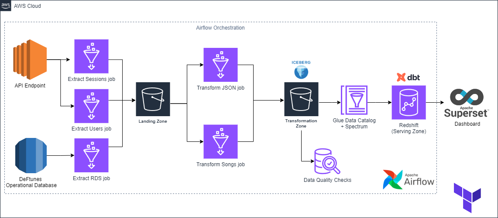

# DeepLearning.AI Data Engineering Professional Certificate

Course 1: Intro to Data Engineering

Course 2: Source Systems, Data Ingestion and Pipelines

Course 3: Data Storage and Queries
- Wk3 Lab2: Streaming with Flink and Flink Studio

Course 4: Data Modeling, Transformation, and Serving
- Wk1 A1: Data modeling with DBT (Star Schema includes dim_date table)
- Wk3 A1: Data modeling with Spark (Star Schema includes dim_date table)
- Wk3 Lab1: CDC with Flink and Debezium
- Wk4 Lab1: Views and Materialized Views with Dbt
- Wk4 Capstone:

